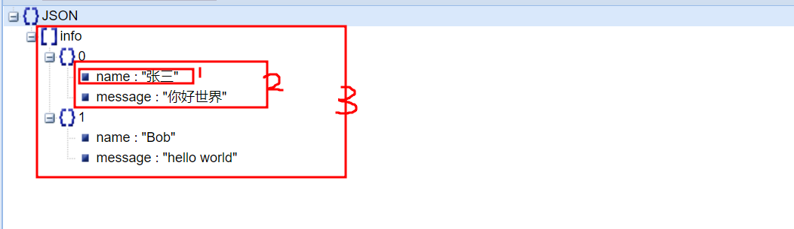

[toc]

## 前言

本文完整代码见仓库。

我正在写一个玩具程序。程序接收到一个request, 并进行解析。解析之后，它需要构造一个response进行恢复。这其中有两个需求:
* 构建一个response，并将转换成字符串，以便通过套接字发送。
* response的body部分，是一个json结构转换的字符串，这样内容的结构比较灵活。

boost提供了[http::response](https://www.boost.org/doc/libs/master/libs/beast/doc/html/beast/ref/boost__beast__http__response.html)和[Chapter 1. Boost.JSON](https://www.boost.org/doc/libs/1_79_0/libs/json/doc/html/index.html)。本文利用这两部分，实现上面的需求。

注：boost在[Version 1.75.0](https://www.boost.org/users/history/version_1_75_0.html)添加的JSON库。ubuntu20包管理器提供的是1.71版本，所以需要进行boost的源码安装，可参考[cmake下切换使用不同版本的boost](https://blog.csdn.net/sinat_38816924/article/details/125024145)。（最开始，我懒得编译安装，去拉去了[boostorg/json](https://github.com/boostorg/json)这一部分，但是它还依赖其他部分，单独不太行似乎。）

---

## 构建Json

在`Boost.JSON`之前，boost已经有json解析工具，[property_tree](https://www.boost.org/doc/libs/1_80_0/doc/html/property_tree.html)。`property_tree`解析配置文件，还是挺顺手的。

`Boost.PropertyTree`的介绍可以参考：[C++ Boost JSON解析库的使用](https://www.miaoerduo.com/2018/06/22/the-usage-of-cpp-boost-json/)、《Boost完全开发指南》7.10 property_tree。

但，既然boost后来专门为json提供了一个库，虽然不知道它为啥好，我们还是使用它吧。

我们带着目标去看文档。假设，我们将构建下面的json结构，并转换成字符串，我们该如何去实现它呢？

```json
{
  "info":[
    {"name":"张三", "message":"你好世界"},
    {"name":"Bob", "message":"hello world"}
  ]
}
```

参考[Document Model](https://www.boost.org/doc/libs/1_80_0/libs/json/doc/html/json/dom.html),boost::json提供了四种模型。

* array: JSON 值的序列容器，支持动态大小和快速、随机访问。接口和性能特征与. std::vector
* object: 具有唯一键的键值对的关联容器，其中键是字符串，映射类型是 JSON 值。搜索、插入和删除具有平均的持续时间复杂度。此外，元素连续存储在内存中，允许缓存友好的迭代。
* string: 连续的字符范围。该库假定字符串的内容仅包含有效的 UTF-8。
* value: 一种特殊的变体，可以保存六种标准 JSON 数据类型中的任何一种。(这种有点特殊，当上面三种搞不定的时候，可以考虑这个)

一般构建json结构，是从最内层开始的。我们看下它的结构。
* 最基础的，是字符串，我们可以用string。
* 序号一，是个键值对，我们可以用object容器。
* 序号二，是两个在同一层次的键值对，所以我们可以加入之前相同的object容器。
* 序号三：是一个数组，我们可以使用arrar。
* 最外面一层，是一个新的object, 它的值也是个json。



分析清楚结构，参考[Quick Look](https://www.boost.org/doc/libs/1_80_0/libs/json/doc/html/json/quick_look.html)，照葫芦画瓢编码即可。

```cpp
#include <vector>
#include <utility>
#include <string>
#include <iostream>
#include <boost/json.hpp>


using namespace std;

int main(int argc, char** argv)
{
  vector<pair<string, string>> info;
  info.push_back(make_pair("张三","你好世界"));
  info.push_back(make_pair("Bob", "hello world"));

  boost::json::array info_array;
  for(auto &in : info) {
    boost::json::object obj;
    obj["name"] = in.first;
    obj["message"] = in.second;
    info_array.emplace_back(obj);
  }
  boost::json::object info_json;
  info_json.emplace("info", info_array);

  string info_json_str = boost::json::serialize(info_json);
  cout << info_json_str << endl;
}
```

输出如下：

```shell
{"info":[{"name":"张三","message":"你好世界"},{"name":"Bob","message":"hello world"}]}
```

---

## 构建response

假定我们已经知道response的基本结构。我之前整理过：[http消息简介](https://blog.csdn.net/sinat_38816924/article/details/125275757)、[http-parse的C++封装](https://blog.csdn.net/sinat_38816924/article/details/127630903)。

如果之前没有看过boost的response的构造，这部分编码会有点难。因为照葫芦画瓢，但是没有个好的葫芦。即，boost的这部分文档写的不好，网上也没有好的参考代码。略微好点的示例代码是[http_examples.hpp](https://www.boost.org/doc/libs/1_68_0/libs/beast/example/doc/http_examples.hpp)。

下面是个示例代码，抛砖引玉的去看看里面的源码，便能比较清楚了。

```cpp
#include <boost/beast/http.hpp>
#include <boost/lexical_cast.hpp>
#include <boost/asio/buffer.hpp>
#include <boost/beast/core/buffers_to_string.hpp>
#include <boost/json.hpp>
#include <string>
#include <iostream>
#include <vector>

using namespace std;

std::string json_body() {
  vector<pair<string, string>> info;
  info.push_back(make_pair("张三","你好世界"));
  info.push_back(make_pair("Bob", "hello world"));

  boost::json::array info_array;
  for(auto &in : info) {
    boost::json::object obj;
    obj["name"] = in.first;
    obj["message"] = in.second;
    info_array.emplace_back(obj);
  }
  boost::json::object info_json;
  info_json.emplace("info", info_array);

  string info_json_str = boost::json::serialize(info_json);
  return info_json_str;
}

int main(int argc, char** argv)
{
  namespace http = boost::beast::http;
  http::response<http::string_body> resp;
  resp.set(http::field::server, "tiny-server"); // 处理请求的软件
  resp.set(http::field::access_control_allow_origin, "*"); // 允许跨与访问
  resp.set(http::field::content_type, "application/json;charset=utf8"); // 返回的内容类型
  resp.body() = json_body(); // body内容
  resp.prepare_payload(); // 根据body的长度，调整Content-Length
  resp.result(http::status::ok);  // 响应值为200

  // 将response转换成字符串
  // https://stackoverflow.com/questions/71514303/how-to-convert-httpresponsehttpstring-bodybase-to-stdstring
  // https://github.com/boostorg/beast/issues/819
  const std::string str_headers = boost::lexical_cast<std::string>(resp.base()); 
  std::string str_body = resp.body().data();
  std::cout << str_headers << str_body;
}
```

输出如下：

```shell
HTTP/1.1 200 OK
Server: tiny-server
Access-Control-Allow-Origin: *
Content-Type: application/json;charset=utf8
Content-Length: 92

{"info":[{"name":"张三","message":"你好世界"},{"name":"Bob","message":"hello world"}]}
```
