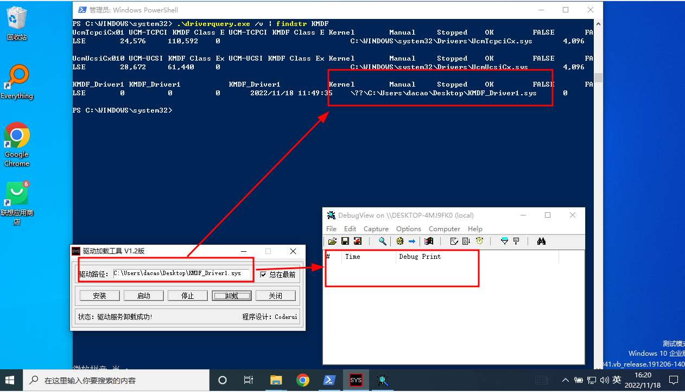

[TOC]

## 前言

参考：[windows驱动开发环境搭建以及helloworld | qwertwwwe](https://qwertwwwe.github.io/windows-driver-develop-setup-environment/)

搭建驱动环境--编写hello驱动--安装测试虚拟机--安装驱动

---

## 编译环境-WDK的安装

挺难搞。最开始，我使用的时vs2022，搞半天也没把编译环境搭起来。

没办法，降到vs2019。

SDK使用的时10.0.19041.0。


到官网下载和SDK版本相近的WDK: [以前的 WDK 版本和其他下载 - Windows drivers | Microsoft Learn](https://learn.microsoft.com/zh-cn/windows-hardware/drivers/other-wdk-downloads)


之后，我们参考[windows驱动开发环境搭建以及helloworld | qwertwwwe](https://qwertwwwe.github.io/windows-driver-develop-setup-environment/), 创建一个KMDF项目，编译下面代码，看能否编译通过。

```c
// come from: https://github.com/dybb8999/Windows-kernel-security-and-driver-development-CD/blob/master/source/first/first.c 

#include <ntddk.h>

VOID DriverUnload(PDRIVER_OBJECT driver)
{
  DbgPrint("first: Our driver is unloading…\r\n");
}

NTSTATUS DriverEntry(PDRIVER_OBJECT driver, PUNICODE_STRING reg_path)
{

  DbgPrint("first: Hello, my salary!");
  driver->DriverUnload = DriverUnload;
  return STATUS_SUCCESS;
}
```


---

## 搭建测试驱动的虚拟机

### win11虚拟机

使用virtualbox，搭建win11虚拟机，是要踩坑的。可见：[如何在VirtualBox 7.0开启TPM和EFI安全启动以在虚拟机中安装或升级到Windows 11 &#8211; Orz小窍门](https://www.orztip.com/?p=714&article_title=virtualbox-7-0-enable-tpm-2-and-efi-secure-boot-to-install-or-upgrade-to-windows-11)

之后，需要关闭签名验证，win11上，我目前只找到这一种有效的方法：[Win11怎么禁用驱动程序强制签名? 关闭Win11驱动强制签名的技巧_windows11_Windows系列_操作系统_脚本之家](https://www.jb51.net/os/win11/813690.html)

设置-恢复-高级启动-选择疑难解答-高级选项-启动设置-按键盘上的 F7 ，就可以禁用驱动程序强制签名了。

(在virtualbox win11中 bios，没有serurity boot选项。)

### win10虚拟机

win10虚拟机常规安装即可。

驱动需要签名之后，才能加载。日常开发，需要禁用使用测试签名代码，可以参考：[加载测试签名代码 - Windows drivers | Microsoft Learn](https://learn.microsoft.com/zh-cn/windows-hardware/drivers/install/the-testsigning-boot-configuration-option)、[windows10 该值受安全引导策略保护，无法进行修改或删除。禁用驱动程序强制签名_wangan094的博客-CSDN博客](https://blog.csdn.net/DH2442897094/article/details/121948221)

```shell
# admin打开powershell，执行下面语句
bcdedit /set testsigning on
```

执行上面语句之后，需要重启。重启之后，可以看到这样的水印。


---

## 在测试机器上运行驱动

我们需要点辅助工具。

* 加载驱动的工具：InstDrv，可以在这里下载，[[原创]驱动加载工具(InstDrv - V1.2中文版)](https://bbs.pediy.com/thread-62835.htm)

* 监视本地系统上的调试输出：DebugView，可以在这里下载， [DebugView - Sysinternals | Microsoft Learn](https://learn.microsoft.com/zh-cn/sysinternals/downloads/debugview)

我并没有看到输出，应该是和输出信息的level有关，暂时不管它：[windows - DebugView doesn&#39;t capture KdPrint output - Stack Overflow](https://stackoverflow.com/questions/63256262/debugview-doesnt-capture-kdprint-output)、[**驱动中打印消息以及过滤机制_一如当初的博客-CSDN博客**](https://blog.csdn.net/aqtata/article/details/92853424)、[[原]你知道怎么使用DebugView查看内核调试信息吗？ - BCN - 博客园](https://www.cnblogs.com/bianchengnan/p/12243145.html)

虽然信息没打印，但是驱动确实被安装了，我们可以使用`driverquery /v | findstr xxx`看到输出信息。



---

## 上面驱动代码含义

上面的驱动代码很短，主要是用来验证环境的安装情况。我们简单的过一遍。

[ntddk.h](https://learn.microsoft.com/zh-cn/windows-hardware/drivers/ddi/ntddk/)是一个内核(接口)头文件。驱动程序都需要需要特定的[例程](https://learn.microsoft.com/zh-cn/windows-hardware/drivers/ddi/_kernel/)。

[DriverEntry](https://learn.microsoft.com/zh-cn/windows-hardware/drivers/ddi/wdm/nc-wdm-driver_initialize)是在加载驱动程序后调用的第一个例程，负责初始化驱动程序。[DriverUnload](https://learn.microsoft.com/zh-cn/windows-hardware/drivers/ddi/wdm/nc-wdm-driver_unload)执行在系统卸载驱动程序之前所需的任何操作。

[dbgPrint](https://learn.microsoft.com/zh-cn/windows-hardware/drivers/ddi/wdm/nf-wdm-dbgprint)向内核调试器发送消息。

---

## 其他

如果，因为一些原因，我们想下载旧版本的visiual studio,到官网我们会发现，不再提供旧版本的Community版本：[Visual Studio 较旧的下载 - 2019、2017、2015 和以前的版本](https://visualstudio.microsoft.com/zh-hans/vs/older-downloads/)

我们可以找见这个答案：[How to download Visual Studio Community Edition 2015 (not 2017) - Stack Overflow](https://stackoverflow.com/questions/44290672/how-to-download-visual-studio-community-edition-2015-not-2017)

这个答案，我回答不了。目前一个比较好的去出，是在wdk界面下载旧版本的Community：[以前的 WDK 版本和其他下载 - Windows drivers | Microsoft Learn](https://learn.microsoft.com/zh-cn/windows-hardware/drivers/other-wdk-downloads)
