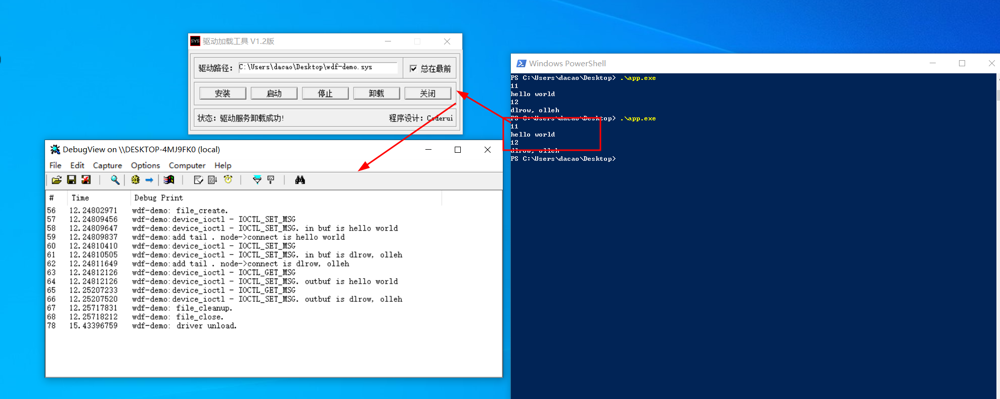

# windows驱动编程-WDF编程

## 前言

注：本文的完整代码见仓库。

我不是从事驱动开发的专业人员，打酱油需要用到下驱动，故来了解下WDF编程。

我之前翻看的是《windows驱动开发技术详解》-张帆。书中的代码也敲了一点点，然后跑去看一些小项目的代码，发现还是没搞懂。

其中的一个原因在于，《windows驱动开发技术详解》书中的驱动是NT式驱动，而我看到的都是WDF框架开发的驱动。搞不清楚这些编程框架的本质区别，但是明显的一点是，从驱动开发框架出现的时间上来说，NT早于WDM, WDM早于WDF。ok，我再去补充下WDF编程接口。

windows这块的中文驱动书籍不多，这次翻看的是《Windows设备驱动程序WDF开发》。这本书似乎挺烂，因为我看明白。。网上有个入门视频，非常nice:[【WDF驱动编程入门-哔哩哔哩】](https://b23.tv/3GXK0ne)。如果有的NT驱动编程基础的话，非常容易入门。关于NT编程基础，可以参考我之前的博客：[windows驱动开发环境搭建以及helloworld](https://da1234cao.blog.csdn.net/article/details/127933589)、[windows内核编程-文件操作](https://da1234cao.blog.csdn.net/article/details/128159702)、[windows驱动编程-应用与内核通信](https://da1234cao.blog.csdn.net/article/details/128341319)

---

## WDF编程前的准备工作

需要NT编程基础，可以参考上面的链接。

WDF编程和NT编程差不多。NT编程中有的东西，WDF也有，只是调用的API不同。我们先看下驱动的组成部分：

* 创建驱动对象。一个驱动对象代表了一个驱动程序，或者说一个内核模块。
* 指定驱动类型，驱动的卸载操作等。
* 创建设备对象。一个驱动对象可以有多个设备。设备是接收请求的实体。
* 为设备创建回调函数。打开/关闭设备执行的回调函数。接收DeviceIoControl发送的制代码，并执行相应的操作。(这里是重点)

## WDF编程

这是一个demo。代码实现：从用户空间传递字符串给内核中的驱动；驱动将字符串保存在一个双向链表中；用户空间从驱动中提取字符串；

### 创建驱动对象

```cpp
	// 创建WDF驱动程序对象
	WDF_DRIVER_CONFIG config;
	WDF_DRIVER_CONFIG_INIT(&config, WDF_NO_EVENT_CALLBACK); // 非pnp驱动，不必提供EvtDriverDeviceAdd
	config.DriverInitFlags |= WdfDriverInitNonPnpDriver;
	config.EvtDriverUnload = driver_unload;
	WDFDRIVER driver;
	NTSTATUS status = WdfDriverCreate(driver_obj, reg_path, WDF_NO_OBJECT_ATTRIBUTES, &config, &driver);
	if (!NT_SUCCESS(status)) {
		KdPrint(("wdf-demo: fail in WdfDriverCreate."));
		return status;
	}
```

### 创建设备对象

```cpp
#include "device.h"

NTSTATUS device_init(WDFDRIVER& driver, WDFDEVICE& device) {
	DECLARE_CONST_UNICODE_STRING(device_name, L"\\Device\\wdf_demo");
	DECLARE_CONST_UNICODE_STRING(dos_device_name, L"\\??\\wdf_demo");

	NTSTATUS status = STATUS_SUCCESS;

	// 创建一个设备对象

	//// 设置设备类型，设备缓冲模式，设备名
	PWDFDEVICE_INIT device_init = WdfControlDeviceInitAllocate(driver, &SDDL_DEVOBJ_SYS_ALL_ADM_RWX_WORLD_RW_RES_R);
	if (device_init == NULL) {
		status = STATUS_INSUFFICIENT_RESOURCES;
		KdPrint(("wdf-demo: fail in WdfControlDeviceInitAllocate."));
		return status;
	}
	WdfDeviceInitSetDeviceType(device_init, FILE_DEVICE_UNKNOWN);
	WdfDeviceInitSetIoType(device_init, WdfDeviceIoBuffered); // 缓冲模式，类似DO_BUFFERED_IO
	WdfDeviceInitAssignName(device_init, &device_name);

	//// 设置设备创建和关闭的回调函数
	WDF_FILEOBJECT_CONFIG file_config;
	WDF_FILEOBJECT_CONFIG_INIT(&file_config, file_create, file_close, file_cleanup);
	WdfDeviceInitSetFileObjectConfig(device_init, &file_config, WDF_NO_OBJECT_ATTRIBUTES);

	status = WdfDeviceCreate(&device_init, WDF_NO_OBJECT_ATTRIBUTES, &device);
	if (!NT_SUCCESS(status)) {
		KdPrint(("wdf-demo: fail in WdfDeviceCreate, ret status is %d", status));
		// WdfControlDeviceInitAllocate得到的WDFDEVICE_INIT 结构，在驱动程序初始化错误的时候必须调用 WdfDeviceInitFree
		// 成功调用 WdfDeviceCreate 后，驱动程序不得调用 WdfDeviceInitFree
		WdfDeviceInitFree(device_init);
		return status;
	}

	//// 该设备的IO操作
	WDF_IO_QUEUE_CONFIG queue_config;
	WDF_IO_QUEUE_CONFIG_INIT_DEFAULT_QUEUE(&queue_config, WdfIoQueueDispatchSequential); // 请求串行处理
	queue_config.EvtIoDeviceControl = device_ioctl; // 请求的处理函数
	WDFQUEUE queue;
	status = WdfIoQueueCreate(device, &queue_config, WDF_NO_OBJECT_ATTRIBUTES, &queue);
	if (!NT_SUCCESS(status)) {
		KdPrint(("wdf-demo: fail in WdfIoQueueCreate, ret status is %d", status));
		return status;
	}

	// 创建设备的符号链接
	status = WdfDeviceCreateSymbolicLink(device, &dos_device_name);
	if (!NT_SUCCESS(status)) {
		KdPrint(("wdf-demo: fail in WdfDeviceCreateSymbolicLink, ret status is %d", status));
		return status;
	}

	WdfControlFinishInitializing(device);

	return status;
}
```

### 设备对象的回调函数

```cpp
#include "io_callbacks.h"
#include "../libdemo/demo_common.h"
#include "list.h"

VOID file_create(IN WDFDEVICE device, IN WDFREQUEST request, IN WDFFILEOBJECT object) {
	UNREFERENCED_PARAMETER(device);
	UNREFERENCED_PARAMETER(object);
	KdPrint(("wdf-demo: file_create."));
	WdfRequestComplete(request, STATUS_SUCCESS);
}


VOID file_close(IN WDFFILEOBJECT object)
{
	KdPrint(("wdf-demo: file_close."));
	UNREFERENCED_PARAMETER(object);
}

VOID file_cleanup(IN WDFFILEOBJECT object)
{
	KdPrint(("wdf-demo: file_cleanup."));
	UNREFERENCED_PARAMETER(object);
}

VOID device_ioctl(IN WDFQUEUE queue, IN WDFREQUEST request,
	IN size_t out_length, IN size_t in_length, IN ULONG code)
{
	UNREFERENCED_PARAMETER(queue);
	UNREFERENCED_PARAMETER(out_length);
	UNREFERENCED_PARAMETER(in_length);

	NTSTATUS status;

	if (code == IOCTL_GET_MSG) {
		KdPrint(("wdf-demo:device_ioctl - IOCTL_GET_MSG"));
		void* outbuf;
		size_t outlen;
		status = WdfRequestRetrieveOutputBuffer(request, 0, &outbuf, &outlen);
		if (!NT_SUCCESS(status)) {
			KdPrint(("wdf-demo:device_ioctl - IOCTL_GET_MSG. get input buffer error: %d", status));
			WdfRequestComplete(request, STATUS_SUCCESS);
			return;
		}

		conn_item* node = remove_head();
		KdPrint(("wdf-demo:device_ioctl - IOCTL_SET_MSG. outbuf is %s", node->connect));
		if (node != NULL) {
			memcpy(outbuf, &node->connect, outlen);
			ExFreePoolWithTag(node, WDF_DEMO_TAG);
			WdfRequestCompleteWithInformation(request, status, strlen((char*)outbuf));
		}
		else {
			WdfRequestComplete(request, STATUS_SUCCESS);
		}
		return;
	}
	else if (code == IOCTL_SET_MSG) {
		KdPrint(("wdf-demo:device_ioctl - IOCTL_SET_MSG"));
		void *inbuf;
		size_t inlen;
		status = WdfRequestRetrieveInputBuffer(request, 0, &inbuf, &inlen);
		if (!NT_SUCCESS(status)) {
			KdPrint(("wdf-demo:device_ioctl - IOCTL_SET_MSG. get input buffer error: %d", status));
			WdfRequestComplete(request, STATUS_SUCCESS);
			return;
		}
		*((char*)inbuf + inlen) = '\0';
		KdPrint(("wdf-demo:device_ioctl - IOCTL_SET_MSG. in buf is %s", (char*)inbuf));
		add_tail(inbuf, inlen);
		WdfRequestComplete(request, STATUS_SUCCESS);
		return;
	}
	else {
		KdPrint(("wdf-demo:device_ioctl - UNKNOWS"));
		WdfRequestComplete(request, STATUS_UNSUCCESSFUL);
	}
}
```

### 链表操作

```cpp
#include "list.h"

LIST_ENTRY connect_list;
WDFWAITLOCK connect_list_lock;

void init_list() {
	WdfWaitLockCreate(WDF_NO_OBJECT_ATTRIBUTES, &connect_list_lock);
	InitializeListHead(&connect_list);
}

BOOLEAN add_tail(PVOID inbuf, size_t inlen) {
	if (inlen >= ENTER_MAX_SIZE) {
		return FALSE;
	}

	conn_item *node = (conn_item*)ExAllocatePool2(POOL_FLAG_NON_PAGED, sizeof(conn_item), WDF_DEMO_TAG);
	if (node == NULL) {
		KdPrint(("fail in ExAllocatePool2"));
		return FALSE;
	}
	memset(node, 0, sizeof(node));
	memcpy(&node->connect, inbuf, ENTER_MAX_SIZE);

	KdPrint(("wdf-demo:add tail . node->connect is %s", node->connect));
	WdfWaitLockAcquire(connect_list_lock, nullptr);
	InsertTailList(&connect_list, &node->list_entry);
	WdfWaitLockRelease(connect_list_lock);

	return TRUE;
}

conn_item* remove_head() {
	WdfWaitLockAcquire(connect_list_lock, nullptr);
	conn_item* node = NULL;
	if (IsListEmpty(&connect_list)) {
		goto end;
	}
	PLIST_ENTRY item = RemoveHeadList(&connect_list);
	node = CONTAINING_RECORD(item, conn_item, list_entry);
end:
	WdfWaitLockRelease(connect_list_lock);
	return node;
}

void clear_list() {
	WdfWaitLockAcquire(connect_list_lock, nullptr);
	while (!IsListEmpty(&connect_list)) {
		PLIST_ENTRY item = RemoveHeadList(&connect_list);
		conn_item* node = CONTAINING_RECORD(item, conn_item, list_entry);
		ExFreePoolWithTag(node, WDF_DEMO_TAG);
	}
	WdfWaitLockRelease(connect_list_lock);
}
```

### 驱动的测试代码

```cpp
#include "../libdemo/demo_common.h"
#include <Windows.h>
#include <iostream>
#include <string>

int main(int argc, char *argv[]) {
    HANDLE device = CreateFile("\\\\.\\wdf_demo", GENERIC_READ | GENERIC_WRITE,
                             0, NULL, OPEN_EXISTING, FILE_ATTRIBUTE_SYSTEM, NULL);                           
  if(device == INVALID_HANDLE_VALUE) {
    DWORD err_code = GetLastError();
    std::cerr << "fail to open device" << std::endl;
    std::cerr << "error code is: " << err_code << std::endl;
    return -1;
  }

  int ret_len = 0;

  std::string msg = "hello world";
  BOOL result = DeviceIoControl(device, IOCTL_SET_MSG, (LPVOID)(msg.c_str()), msg.size(), NULL, 0, (LPDWORD)&ret_len, NULL);
  if(result == 0) {
    DWORD err_code = GetLastError();
    std::cerr << "fail in DeviceIoControl-IOCTL_SET_MSG. error code is: " << err_code << std::endl;
    return 0;
  } 
  std::string msg_2 = "dlrow olleh";
  result = DeviceIoControl(device, IOCTL_SET_MSG, (LPVOID)(msg_2.c_str()), msg_2.size(), NULL, 0, (LPDWORD)&ret_len, NULL);


  char get_msg[1024] = { 0 };
  result = DeviceIoControl(device, IOCTL_GET_MSG, NULL, 0, &get_msg, 1024, (LPDWORD)&ret_len, NULL);
  std::cout << ret_len << std::endl;
  std::cout << get_msg << std::endl;
  char get_msg_2[1024] = { 0 };
  result = DeviceIoControl(device, IOCTL_GET_MSG, NULL, 0, &get_msg_2, 1024, (LPDWORD)&ret_len, NULL);
  std::cout << ret_len << std::endl;
  std::cout << get_msg_2 << std::endl;


  return 0;
}
```

输出如下所示：

