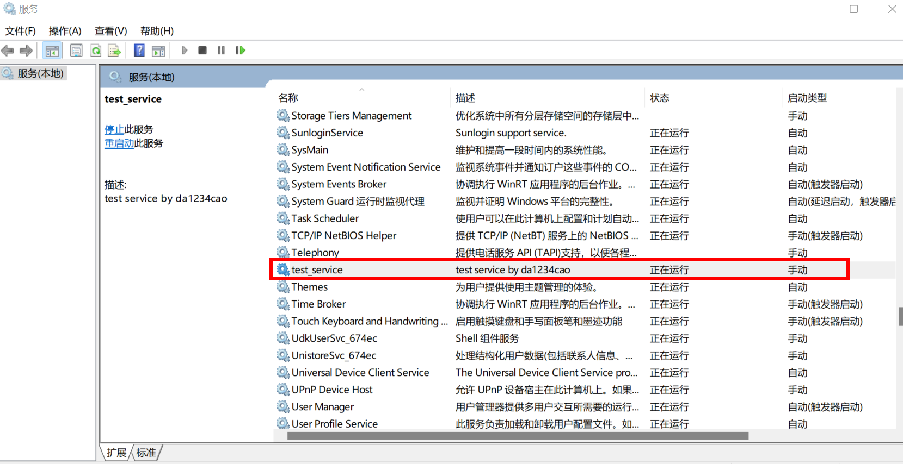

[TOC]

# windows服务编程

## 前言

在linux中，如果需要一个程序在后台持续提供服务，我们一般会使用守护进程。

守护进程(daemon)是生存期长的一种进程。它们常常在系统引导装入时启动，仅在系统关闭时才终止。它们没有控制终端，在后台运行。

**在windows上，如何使用cpp创建一个守护进程呢**？这里给出两种方案。其一是[**服务程序** - Win32 apps | Microsoft Learn](https://learn.microsoft.com/zh-cn/windows/win32/services/service-programs)。其二是，创建一个后台程序，使用信号控制开启与关闭，并将程序加入开机自启。服务程序的方案是比较好的。

下面，我们介绍下这两个方案。

注：本文完整代码见仓库。

---

### 方案一：服务程序

[如何检查Windows系统下某服务的状态是启用还是禁用](http://robotrs.lenovo.com.cn/ZmptY2NtYW5hZ2Vy/p4data/Rdata/Rfiles/rhjcwinxtxfuzt.html)

"win+R"键打开运行->输入输入“services.msc”按回车。

下面这个“test_service"是本文创建的服务，后面会介绍如何实现。



---

### 方案二：后台程序

我们需要先编写这样一个程序：程序可以后台运行；程序可以接收信号，以进行控制，如关闭；

此时，我们将程序加入开机自启，即可实现和上面服务程序类似的功能。

至于如何将程序加入开机自启，可参考：[linux-windows服务设置-##windows中程序开机自启](https://blog.csdn.net/sinat_38816924/article/details/126563564) 

---

### 对比

方案二，相对于方案一，缺点非常明显，需要自己写启动/停止等代码。或者说，方案二没有接入windows系统的服务管理。

方案二的缺点，某时候也是优点。如果有一套跨平台的信号库，如[boost asio signal_set - 1.81.0](https://www.boost.org/doc/libs/1_81_0/doc/html/boost_asio/reference/signal_set.html)，那么一套相同的代码，不需要封装即可写出跨平台的服务程序。当然，前提是，不在意windows的服务管理(windows service manager, SCM)程序的话。

---

## windows服务编程

下面介绍下windows服务编程的API。

参考：

* [服务程序 - Win32 apps | Microsoft Learn](https://learn.microsoft.com/zh-cn/windows/win32/services/service-programs)

* [实现一个Windows服务_一个程序员的修炼之路的博客-CSDN博客_如何写一个windows服务](https://blog.csdn.net/CJF_iceKing/article/details/112427792)

**上面两个链接看明白，基本不用看下面的内容**。

下面仅仅是我的学习记录吧。

第一步：[服务入口点 - Win32 apps | Microsoft Learn](https://learn.microsoft.com/zh-cn/windows/win32/services/service-entry-point)。

* SCM等待调用[StartServiceCtrlDispatcher](https://learn.microsoft.com/zh-cn/windows/win32/api/winsvc/nf-winsvc-startservicectrldispatchera)。
  
  * 如果 StartServiceCtrlDispatcher 成功(返回值为非零值)，则调用线程不会返回，直到进程中的所有正在运行的服务都进入SERVICE_STOPPED状态。 该线程充当控制调度程序。SCM 通过命名管道向此线程发送控制请求。
  
  * 如果函数失败，则返回值为零。 要获得更多的错误信息，请调用 GetLastError。

```cpp
SERVICE_STATUS_HANDLE service_status_handle;
SERVICE_STATUS service_statu;
LPSTR service_name = "test_service";

void start() {
    SERVICE_TABLE_ENTRYA service_table[] = {
        {service_name, (LPSERVICE_MAIN_FUNCTIONA)service_main},
        {NULL, NULL}
    };
    WriteLog("enter main.");

    if(StartServiceCtrlDispatcher(service_table) ==0) {
        WriteLog("StartServiceCtrlDispatcher fail.");
        return;
    }
}
```

第二步：[ServiceMain 函数 - Win32 apps | Microsoft Learn](https://learn.microsoft.com/zh-cn/windows/win32/services/service-servicemain-function)。

* 当服务控制程序请求新服务运行时，服务控制管理器 (SCM) 启动服务并向控制调度程序发送启动请求。 控制调度程序创建一个新线程，用于为服务执行 [ServiceMain](https://learn.microsoft.com/zh-cn/windows/win32/api/winsvc/nc-winsvc-lpservice_main_functiona) 函数。

* ServiceMain 函数中需要注册控制处理函数。

* 执行初始化。如果初始化时间应超过一秒，则服务应使用以下初始化技术之一：
  
  * 调用 [SetServiceStatus](https://learn.microsoft.com/zh-cn/windows/desktop/api/Winsvc/nf-winsvc-setservicestatus) 函数以报告SERVICE_RUNNING，但在初始化完成之前不接受任何控件。 该服务通过将 dwCurrentState 设置为 SERVICE_RUNNING，并在 [SERVICE_STATUS](https://learn.microsoft.com/zh-cn/windows/desktop/api/Winsvc/ns-winsvc-service_status) 结构中将dwControlsAccepted 设置为 0 来执行此操作。 这可确保 SCM 在服务准备就绪之前不会向服务发送任何控制请求，并释放 SCM 来管理其他服务。 对于性能，建议使用此方法进行初始化，尤其是对于自动启动服务。
  
  * 报告SERVICE_START_PENDING，不接受任何控件，并指定等待提示。 如果服务的初始化代码执行所需时间超过初始等待提示值的任务，则代码必须定期调用 [SetServiceStatus](https://learn.microsoft.com/zh-cn/windows/desktop/api/Winsvc/nf-winsvc-setservicestatus) 函数， (可能带有修订的等待提示) 来指示正在进行进度。使用此方法的服务还可以指定检查点值，并在长时间初始化期间定期递增值。
  
  * 初始化完成后，调用 [SetServiceStatus](https://learn.microsoft.com/zh-cn/windows/desktop/api/Winsvc/nf-winsvc-setservicestatus) 将服务状态设置为SERVICE_RUNNING并指定服务准备接受的控件。 有关控件列表，请参阅 [SERVICE_STATUS](https://learn.microsoft.com/zh-cn/windows/desktop/api/Winsvc/ns-winsvc-service_status) 结构。
  
  * 如果服务正在初始化或运行时发生错误，则服务应调用 [SetServiceStatus](https://learn.microsoft.com/zh-cn/windows/desktop/api/Winsvc/nf-winsvc-setservicestatus) 以将服务状态设置为SERVICE_STOP_PENDING（如果清理时间较长）。 清理完成后，调用 SetServiceStatus 将服务状态设置为从最后一个线程终止SERVICE_STOPPED。 请务必设置[SERVICE_STATUS](https://learn.microsoft.com/zh-cn/windows/desktop/api/Winsvc/ns-winsvc-service_status)结构的 dwServiceSpecificExitCode 和 dwWin32ExitCode 成员来标识错误。

* 初始化成功后，执行服务任务。服务状态的任何更改都要求调用 [SetServiceStatus](https://learn.microsoft.com/zh-cn/windows/desktop/api/Winsvc/nf-winsvc-setservicestatus) 来报告新的状态信息。（是的，我们的业务代码在这里）

```cpp
void service_main(DWORD argc, LPSTR *argv) {
    // 注册控制函数
    service_status_handle = RegisterServiceCtrlHandler(service_name, service_control);
    if(service_status_handle == 0) {
        WriteLog("RegisterServiceCtrlHandler fail.");
        return;
    }

    // 告诉SCM，当前服务正在启动中
    // dwWaitHint=3000ms是预估的时间. 
    // 如果超过这个时间，且dwCheckPoint 尚未递增或 dwCurrentState 未更改，则服务控制管理器或服务控制程序可以假定出错并且应停止服务
    if(ReportSvcStatus(SERVICE_START_PENDING, NO_ERROR, 3000) == 0) {
        WriteLog("start fail");
        ReportSvcStatus(SERVICE_STOPPED, GetLastError(), 0);
        WriteLog(std::to_string(GetLastError()).c_str());
        return;
    }

    // 准备工作

    // 做完准备工作后，告诉SCM服务已经启动
    if(ReportSvcStatus(SERVICE_RUNNING, NO_ERROR, 0) ==0) {
        WriteLog("run fail");
        ReportSvcStatus(SERVICE_STOPPED, GetLastError(), 0);
        return;
    }

    // 运行正在工作代码，通常是个无限循环
    WriteLog("work.run()");
    work::instance().run();
    return;
}
```

第三步，实现[服务控制处理程序函数 - Win32 apps | Microsoft Learn](https://learn.microsoft.com/zh-cn/windows/win32/services/service-control-handler-function)

每个服务都有一个控制处理程序， [即处理程序](https://learn.microsoft.com/zh-cn/windows/desktop/api/Winsvc/nc-winsvc-lphandler_function) 函数，当服务进程从服务控制程序收到控件请求时，由控制调度程序调用。 因此，此函数在控件调度程序上下文中执行。

* 服务调用 [RegisterServiceCtrlHandler](https://learn.microsoft.com/zh-cn/windows/desktop/api/Winsvc/nf-winsvc-registerservicectrlhandlera) 或 [RegisterServiceCtrlHandlerEx](https://learn.microsoft.com/zh-cn/windows/desktop/api/Winsvc/nf-winsvc-registerservicectrlhandlerexa) 函数来注册其服务控制处理程序函数。

* 调用服务控制处理程序时，服务必须调用 [SetServiceStatus](https://learn.microsoft.com/zh-cn/windows/desktop/api/Winsvc/nf-winsvc-setservicestatus) 函数，以便仅在处理控制代码导致服务状态发生更改时才将其状态报告给 SCM。 如果处理控制代码不会导致服务状态更改，则无需调用 SetServiceStatus。

* 如果服务接受 SERVICE_CONTROL_STO 控制代码，则必须在收到后停止，转到 SERVICE_STOP_PENDING 或 SERVICE_STOPPED 状态。控制处理程序必须在 30 秒内返回，或者 SCM 返回错误。 如果服务在执行控制处理程序时必须执行较长处理，则应创建一个辅助线程来执行冗长的处理，然后从控制处理程序返回。

```cpp
void service_control(DWORD ctrl_code) {
    switch(ctrl_code) {
        case SERVICE_CONTROL_SHUTDOWN: // 系统关闭
        case SERVICE_CONTROL_STOP: // 服务停止
            // call stop funciton
            ReportSvcStatus(SERVICE_STOP_PENDING, NO_ERROR, 3000);
            WriteLog("work.stop()");
            work::instance().stop();
            ReportSvcStatus(SERVICE_STOPPED, NO_ERROR, 3000);
            break;
        default:
            break;
    }
}
```

过程中使用的[服务状态转换 - Win32 apps | Microsoft Learn](https://learn.microsoft.com/zh-cn/windows/win32/services/service-status-transitions)代码如下。

```cpp
BOOL ReportSvcStatus(DWORD dwCurrentState,DWORD dwWin32ExitCode, DWORD dwWaitHint) {
    static DWORD dwCheckPoint = 1;
    // Fill in the SERVICE_STATUS structure.

    // 官方提供的示例中没有指定服务：https://learn.microsoft.com/zh-cn/windows/win32/services/sample-mc
    // 开始的时候，我没有下面这一行。我用sc.exe type=own指定，但是SetServiceStatus报错为ERROR_INVALID_DATA
    // 不知道是不是代码中必须要指定，否则会报错
    service_statu.dwServiceType = SERVICE_WIN32_OWN_PROCESS;

    service_statu.dwCurrentState = dwCurrentState;
    service_statu.dwWin32ExitCode = dwWin32ExitCode;
    service_statu.dwWaitHint = dwWaitHint; // 挂起开始、停止、暂停或继续操作所需的估计时间

    if (dwCurrentState == SERVICE_START_PENDING) {
        service_statu.dwControlsAccepted = 0; // 正在启动，此时不接受控制码
    } else {
        service_statu.dwControlsAccepted = SERVICE_ACCEPT_STOP; // 服务可以停止。此控制代码允许服务接收 SERVICE_CONTROL_STOP 通知
    }

    // 服务定期递增的检查点值，以在长时间的启动、停止、暂停或继续操作期间报告其进度
    if ( (dwCurrentState == SERVICE_RUNNING) ||
        (dwCurrentState == SERVICE_STOPPED) )
        service_statu.dwCheckPoint = 0;
    else service_statu.dwCheckPoint = dwCheckPoint++;

    // Report the status of the service to the SCM.
    return SetServiceStatus(service_status_handle, &service::service_statu);
}
```

如果明白上面过程，看下能不能理解这张图。图片来自：[实现一个Windows服务_一个程序员的修炼之路的博客-CSDN博客_如何写一个windows服务](https://blog.csdn.net/CJF_iceKing/article/details/112427792)


---

## windows服务控制

上面我在代码中并没有去实现服务安装的代码。因为`sc.exe`程序可以帮助我们做到。命令的使用，可以参考下面两个链接：

* [Sc | Microsoft Learn](https://learn.microsoft.com/zh-cn/previous-versions/windows/it-pro/windows-server-2012-r2-and-2012/cc754599(v=ws.11))

* [sc.exe配置 | Microsoft Learn](https://learn.microsoft.com/zh-cn/windows-server/administration/windows-commands/sc-config)

下面，我们使用命令，控制上面的服务。

```shell
# 安装
 sc.exe create test_service binpath=xxx\test_service.exe  start=demand error=normal
 
# 启动
 sc.exe start test_service
 
# 查询
PS C:\Windows\system32> sc.exe query test_service

SERVICE_NAME: test_service
        TYPE               : 10  WIN32_OWN_PROCESS
        STATE              : 4  RUNNING
                                (STOPPABLE, NOT_PAUSABLE, IGNORES_SHUTDOWN)
        WIN32_EXIT_CODE    : 0  (0x0)
        SERVICE_EXIT_CODE  : 0  (0x0)
        CHECKPOINT         : 0x0
        WAIT_HINT          : 0x0
 
# 停止
sc.exe stop test_service
 
# 删除 
sc.exe delete test_service
```
